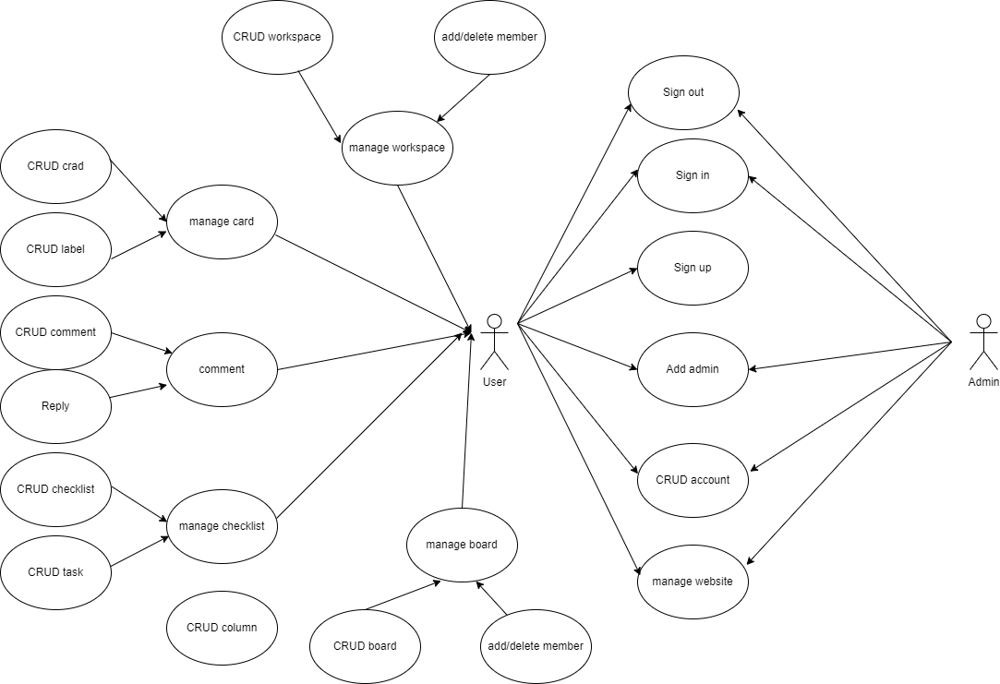
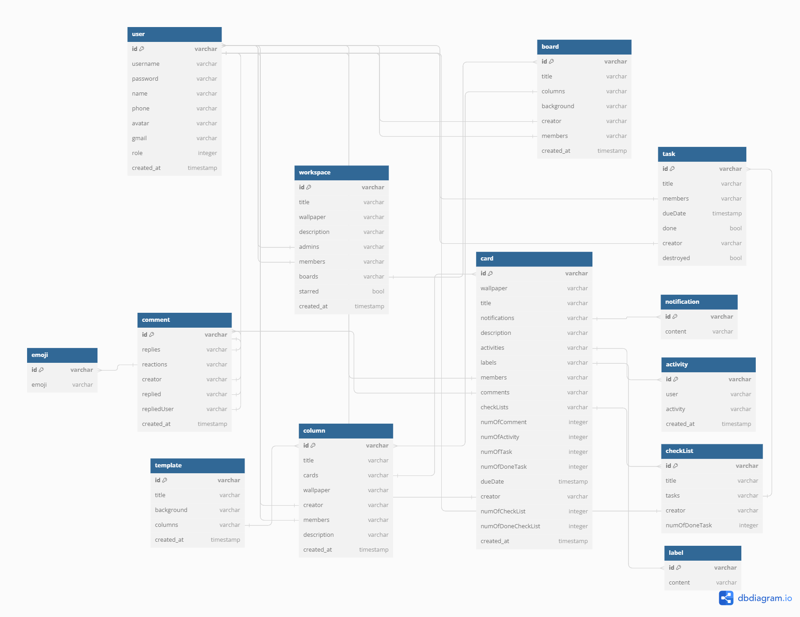
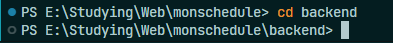
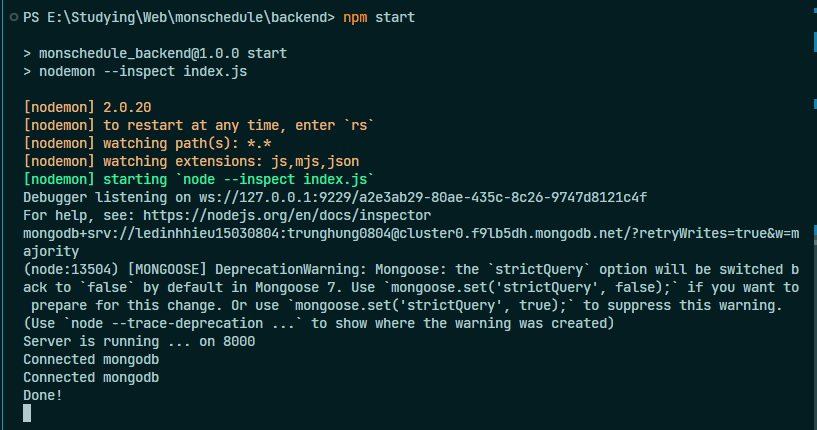

# monschedule

Monschedule is a website that helps you to make plans, to make your life better.

# System design

1. Usecase:
<br/>
<div align="center">

</div>
<br/>
2. Database design:
<br/>
<div align="center">

</div>
<br/>

# Implementation

1. Clone or download project:

```bash
git clone https://github.com/Lindis0804/monschedule
```

2. Backend:

- Switch to folder backend:

```bash
cd backend
```

<br/>
<div align="center">

</div>
<br/>
- Install neccessary packages:

```bash
npm install
```

- Run server:

```bash
npm start
```

=> Result:
<br/>

<div align="center">

</div>
<br/>
3. Front-end:
